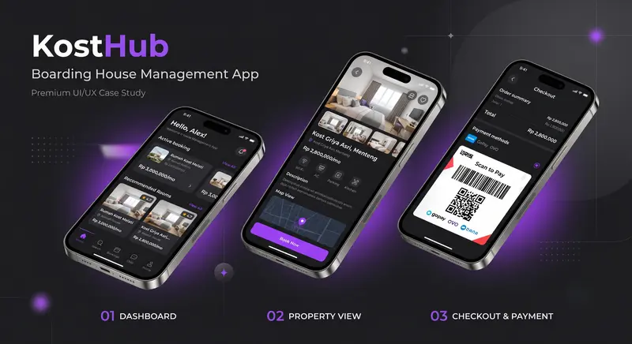
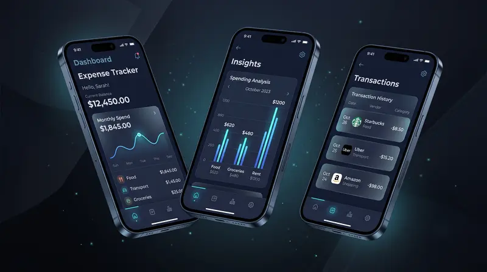
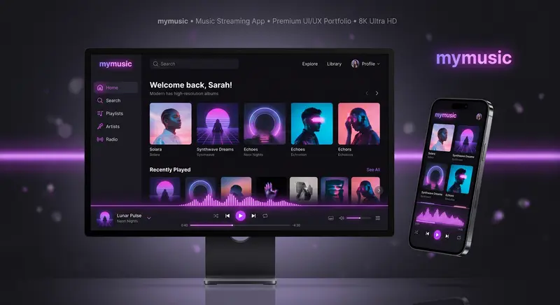

<div align="center">

# Galxtria

### Frontend Developer

**Engineering digital experiences with aesthetic precision and seamless interaction design.**

[](https://github.com/galxtria/Galxtria)
[](mailto:utamapradita5@gmail.com)
[](https://github.com/galxtria)
[](https://www.instagram.com/galxtria/)
[](https://www.linkedin.com/in/praditautama25)


</div>

---

## 👨‍💻 About Me

> I believe great interfaces are invisible.

They're built with clean, component-driven code and express themselves through interactions that feel intuitive, precise, and effortless to use.

- 🎯 Focus: **Frontend Development — React, Mobile & Cross-Platform Apps**
- 🌱 Currently: **Building multi-platform apps & exploring AI integration**
- 🎓 Background: **RPL (2021) → Web & Graphic Design Intern (2022–2023) → Informatics Bachelor (2024–now)**
- 💬 Philosophy: Typography, spacing, animation timing, and component architecture — optimised for clarity, speed, and pixel-perfect craft.
- 📫 Reach me: **utamapradita5@gmail.com**
- 🟢 Status: **Available for projects & collaborations**

---

## 🛠️ Tech Stack

<div align="center">

[](https://skillicons.dev)

</div>

| Category | Technologies |
|----------|--------------|
| **Frontend** | React, Next.js, TypeScript, JavaScript, Tailwind CSS |
| **Mobile** | Flutter, Dart, Java (Android), Firebase |
| **Backend** | Laravel, PHP, Node.js, MySQL, Firebase |
| **Tools & Design** | Figma, Git, Android Studio, Vite, Framer Motion |
| **Other** | Python |

---

## 🚀 Featured Projects

### 1. KostHub App — `2026`
> Boarding house management system engineered for financial efficiency and real-time room tracking across multiple properties.



- Real-time room occupancy tracking
- Automated financial reporting & revenue analytics
- Tenant management + payment reminders

**`Java` `Android` `Firebase` `Material UI`**

### 2. Expense Tracker — `2026`
> A sleek, automated mobile application designed for seamless financial management and budget organization.



- Log, categorize & analyze daily transactions
- Real-time budget monitoring
- Mobile-first visual data insights

**`Flutter` `Dart` `Firebase`**

### 3. My Music — `2025`
> Automated music player application with intelligent playlist organization and seamless audio playback.



- Auto-generated playlists based on listening habits
- Crossfade, equalizer & responsive UI
- Library indexing + personalized recommendations

**`Laravel` `MySQL` `Tailwind`**

---

## 🗺️ Journey

| Year | Milestone |
|------|-----------|
| `2021` | **Began RPL Journey** — Explored software engineering fundamentals and web development at SMK. |
| `2022 – 2023` | **Web & Graphic Design Intern** — Built responsive websites and digital design assets. |
| `2024` | **Graduated & Enrolled in Informatics** — Completed RPL program, started Bachelor's degree in Informatics. |
| `2026 – Present` | **Building Multi-Platform Apps** — Cross-platform apps + AI integration. |

---

## 📊 GitHub Stats

<div align="center">


</div>

---

## 🌐 This Portfolio Website

This repo (`galxtria/Galxtria`) is also the source code for my portfolio site — the design this profile is based on.

**Built with:** `React 19` `Vite` `Tailwind CSS v4` `Framer Motion` `Dark / Light Mode` `Custom Cursor` `Splash Screen` `Horizontal Project Carousel`

```bash
# run locally
npm install
npm run dev

# build
npm run build
```

**Features:**
- ✨ Premium splash screen + typographic hero
- 🌙 / ☀️ Moon (dark) / Sun (light) celestial theme
- 🖱️ Custom cursor, magnetic buttons, parallax orbs
- 📱 Fully responsive + mobile-optimized
- 🃏 Glassmorphism project modal & contact cards

---

## 📬 Let's Build Something Amazing

Got a project in mind? Let's collaborate and create something extraordinary together.

- 📧 Email: [utamapradita5@gmail.com](mailto:utamapradita5@gmail.com)
- 💼 LinkedIn: [Pradita Utama](https://www.linkedin.com/in/praditautama25)
- 📸 Instagram: [@galxtria](https://www.instagram.com/galxtria/)

<div align="center">

**© 2026 Galxtria.**

</div>
